## DIU - Práctica 2
Prácticas Diseño Interfaces de Usuario 2022-23 (Tema: turismo)

Grupo: DIU3.LosMijos  Curso: 2022/23 
Actualizado: 25/04/2023

Proyecto: 
 Granada Handcraft: aplicación web de compra de experiencias personalizables de artesanía nazarí en la ciudad de Granada.

Descripción: 
 Nuestra aplicación web está orientada a la personalización de una especie de paquetes turísticos enfocados a la artesanía nazarí en Granada. La idea es ofrecer un conjunto de opciones elegibles por el usuario final, dotándolo de flexibilidad, de manera que tenga mayor interés en la realización de este tipo de actividades. Además, cabe reseñar que queremos involucrar a empresas locales tanto para ampliar las opciones de personalización, como fomentar una sinergia de empresas locales.

Logotipo:

Miembros
 * :bust_in_silhouette:   Luis Miguel Guirado Bautista     :octocat:     
 * :bust_in_silhouette:   Miguel Ángel Serrano Villena     :octocat:

GitHub: https://github.com/DIU3-LosMijos/DIU3.LosMijos

### IDEACIÓN

 Tras haber analizado los defectos de las visitas a los talleres de artesanía nazarí de Granada, así como tras haber elaborado una serie de críticas constructivas en torno a esto, hemos ideado una propuesta para impulsar este tipo de experiencias en la ciudad de Granada. Para ello, hemos diseñado una aplicación web enfocada en esto mismo, pero aportando aspectos novedosos e interesantes, de cara a mejorar la experiencia de los/as usuarios/as finales: Granada Handcraft.

#### Malla receptora de información

Hemos elegido esta herramienta por la facilidad de uso junto con la agilidad visual que brinda a la hora de ver rápidamente aspectos relacionados con el surgimiento de la idea de nuestra aplicación web.

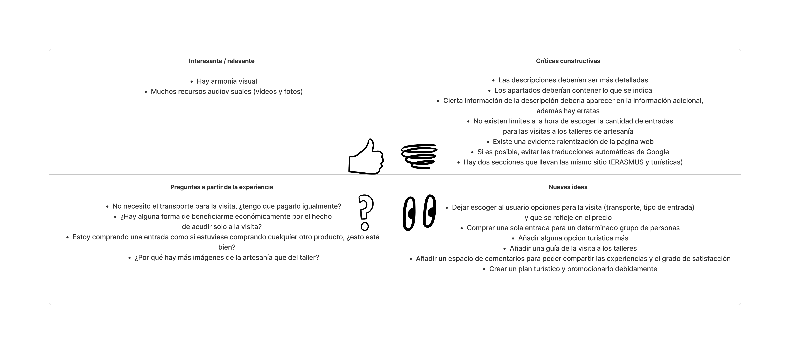

### PROPUESTA DE VALOR

 En la descripción del presente archivo se ha aportado información referente a nuestro proyecto web, pero a continuación vamos a reflejar una serie de aspectos relevantes de cara a conformar una estructura más sólida sobre el sentido de nuestro proyecto.
 Antes de nada, cabe mencionar que hemos analizado las necesidades de nuestros/as usuarios/as, la misión de nuestro proyecto, los objetivos a corto y largo plazo que pretendemos alcanzar como organización, las acciones que pretendemos que lleven a cabo nuestros/as usuarios/as en nuestra web, así como la forma en la que mediremos el éxito de nuestro proyecto (indicadores de éxito).

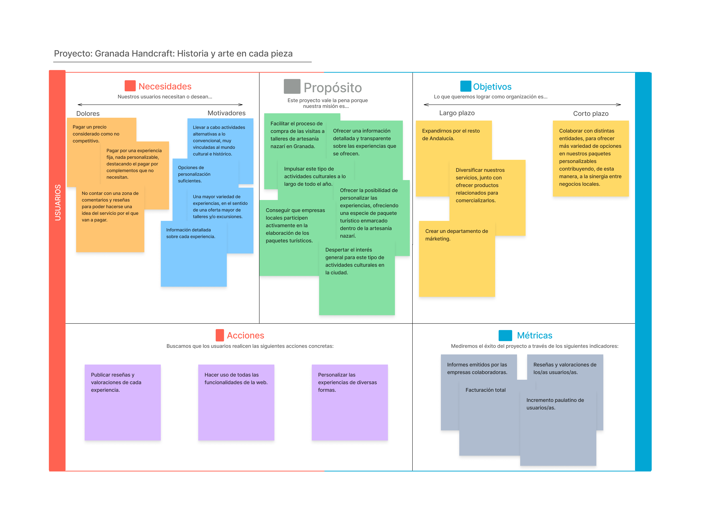

### TASK ANALYSIS

 Con la ayuda de la propuesta de valor anterior, hemos identificado quiénes serían nuestros principales usuarios/as. Encontramos dos tipos de usuarios/as: por un lado, tenemos a los/as usuarios/as que harán uso de la web para comprar experiencias y, por otro, tenemos a empresas locales que colaborarán con nosotros para aparecer como opciones en la personalización de las experiencias.
 Dicho esto, vamos a proceder a especificar más cada uno de estos/as tipos de usuarios/as:
 * Los/as usuarios/as principales, que serán los/as que comprarán las experiencias. Estos/as podrán ver las diferentes experiencias que se ofertan, modificar diversas opciones de sus perfiles de usuario, realizar reseñas y valoraciones y, por supuesto, comprar las entradas para dichas experiencias (teniendo a su disposición varios tipos de funcionalidades para la gestión de las compras, como son un historial con experiencias ya compradas en el pasado, un carrito con las compras pendientes de finalizar y un apartado con las experiencias marcadas como favoritas). Dentro de este conjunto, se pueden distinguir los siguientes grupos de usuarios/as:
     * Grupos normales: conjunto de personas adultas que quieren acudir juntas a la experiencia.
     * Grupos especiales: conjunto de personas adultas junto con menores de edad que quieren acudir juntas a la experiencia.
     * Individuos: personas que quieren acudir en solitario a la experiencia.
 * Las empresas locales colaboradoras, que serán las que podrán añadir sus servicios al sistema. Estas únicamente podrán añadir sus servicios a las distintas experiencias que les interesen y modificar diversas opciones de sus perfiles de usuario.
 A continuación se presenta una matriz con las tareas que se pueden realizar en nuestra web (filas) y los tipos y subtipos de usuarios de nuestro sistema (columnas). En esta matriz se representa tanto la frecuencia de uso de cada tarea en función del tipo de usuario (A: alta, M: media, B: baja), como las tareas y perfiles más críticos e importantes (marcados con un fondo gris; esto ayudará a indentificar claramente aquellas tareas que deben de ser diseñadas con más detalle):

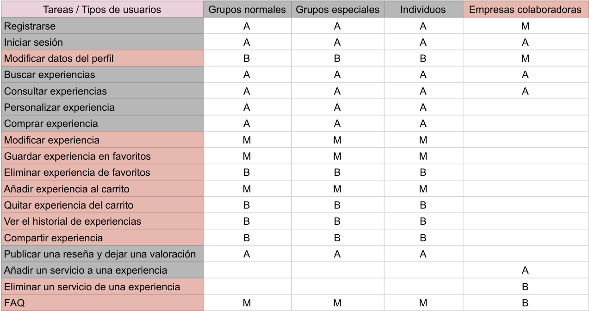

 Nota: el motivo que nos ha llevado a elegir esta herramienta es la posibilidad de comprimir una información tan amplia e importante como esta, pudiendo observar fácil y rápido la funcionalidad general del sistema y el comportamiento de los diferentes usuarios/as con esta.

### ARQUITECTURA DE INFORMACIÓN

#### *Sitemap*

Esquema de la estructura de nuestro sitio web

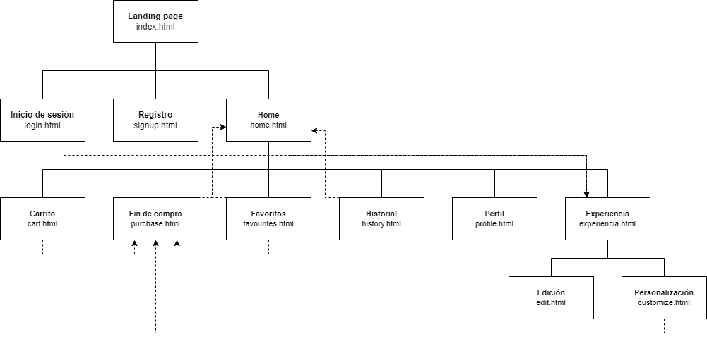

#### Labelling

Descripción breve de cada una de las páginas indicadas en el *Sitemap*

| Nombre      | Descripción |
|-------------|-------------|
| **Landing page** | Primera página que verán los usuarios nuevos y empresas. Tendrá una introducción llamativa (contenido destacado de la empresa). Incluirá información de contacto y ubicación |
| **Inicio de sesión** | Página dirigida a todos los usuarios y empresas que tengan una cuenta en la plataforma para que puedan iniciar una nueva sesión |
| **Registro** | Dirigida a usuarios y/o empresas que deseen crear una nueva cuenta en la plataforma |
| **Home** | Página principal para usuarios y empresas ya registrados, tendrá formato de tienda online, con una galería deslizante con las imágenes de lo que ofrece la plataforma y filtros para buscar según ciertos criterios |
| **Carrito** | Lista de los productos pendientes a comprar por una cuenta. Se podran ver los detalles de los productos, comprar alguno de los productos o eliminarlos de la lista. Una vez se desee tramitar la compra, se vaciará el carrito. |
| **Fin de compra** | Pantalla con instrucciones para hacer un seguimiento de los productos comprados. También se generará un identificador de pedido. |
| **Favoritos** | Productos guardados por el usuario para su interés. Se podrán ver los detalles de los productos, comprarlos directamente, añadirlos al carrito o quitarlos de la misma lista. |
| **Historial** | Lista de pedidos realizados anteriormente. Se podrán ver los detalles del pedido (lista de los productos incluidos) y se podrá volver a añadir al carrito los productos del pedido para su posterior compra. |
| **Perfil** | Un menú con las distintas opciones a personalizar del perfil de una cuenta. Habrá dos versiones: una destinada a los usuarios (cheques de descuento) y otra destinada a las empresas (gestión de servicios) |
| **Experiencia** | Una página más detallada acerca de una experiencia, con una galería de fotos, título y descripción de la misma. Habrá dos versiones: una destinada a los usuarios (añadir al carrito, añadir a favoritos o comprar directamente) y otra destinada a las empresas (editar detalles de la página). También habrá un panel desplegable para publicar comentarios acerca de la experiencia. |
| **Edición** | Exclusiva para empresas. Aquí se podrán editar los detalles de una página concreta. |
| **Personalización** | Exclusiva para usuarios. Aquí el usuario podrá personalizar una experiencia de acuerdo a sus necesidades (número de personas, entradas infantiles, consideraciones, servicios, etc.). Una vez terminado, el usuario podrá añadirlo al carrito o comprarlo directamente |

### Prototipo Lo-FI Wireframe

 Tras todo lo anterior, en esta sección se presentan los prototipos diseñados para la interfaz de nuestra aplicación web. La misión de estos prototipos es plasmar una visión general del funcionamiento de nuestro sistema.

 El diseño ha sido llevado a cabo mediante el empleo de Figma en su versión web, la cual es un editor de gráficos vectorial y una herramienta de generación de prototipos que permite el trabajo colaborativo; ha sido una opción estupenda para cubrir perfectamente esta etapa.

 A continuación se muestran los diferentes prototipos, diferenciando las ventanas que serán vistas en función de las dos áreas diferenciadas en la landing page (clientes y empresas). Los clientes son aquel conjunto que comprará las experiencias y empresas son aquel conjunto de empresas que colaborarán con nosotros para incorporar servicios a las experiencias:

#### Landing page

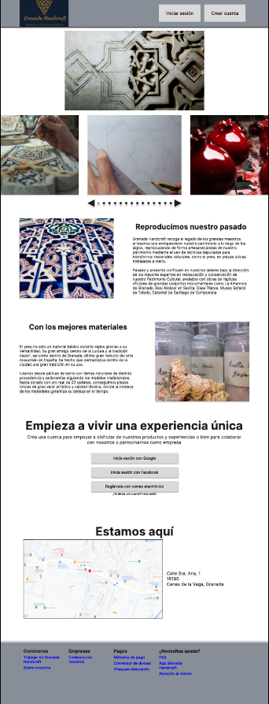

#### Inicio de sesión (clientes y empresas)

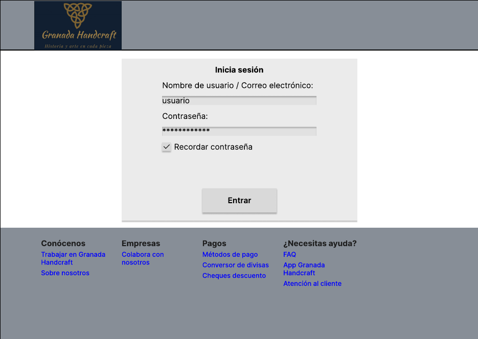

#### Registro (clientes y empresas)

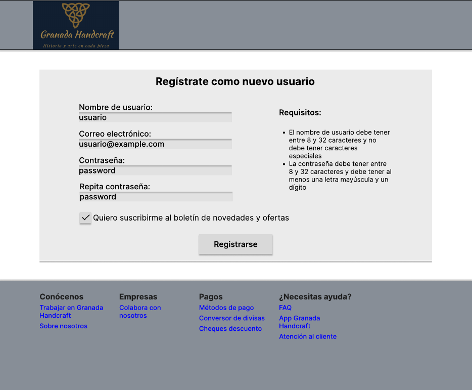

#### Home page (clientes y empresas)

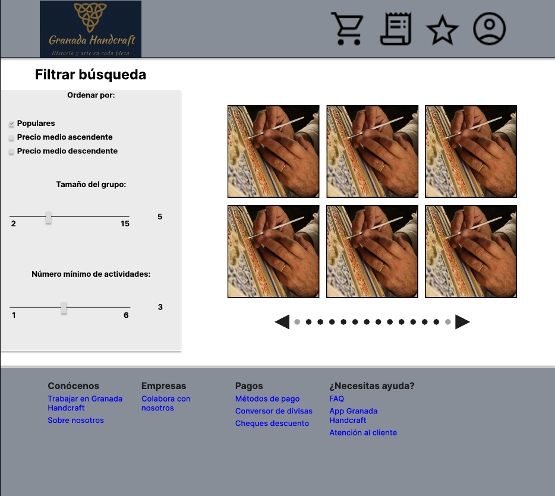

#### Favoritos (clientes y empresas)

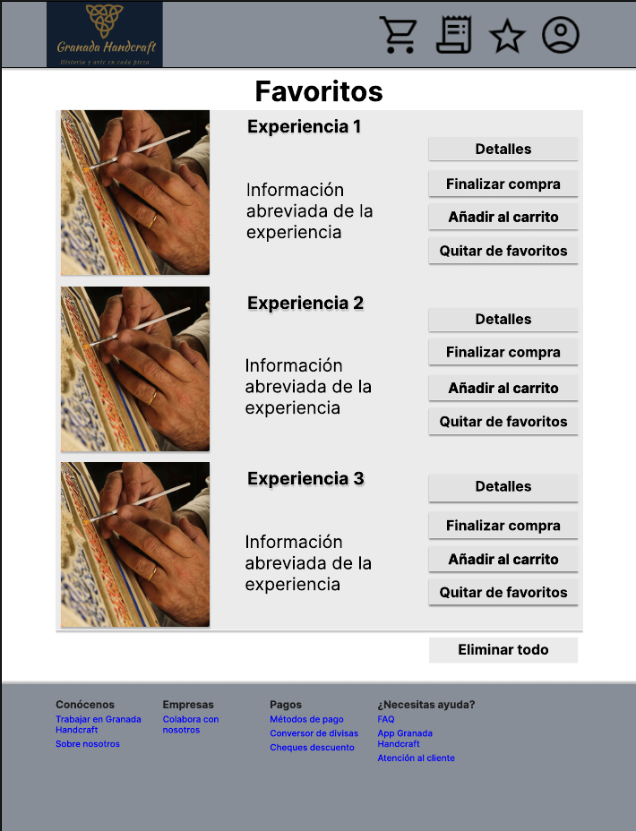

#### Descripción experiencia (clientes)

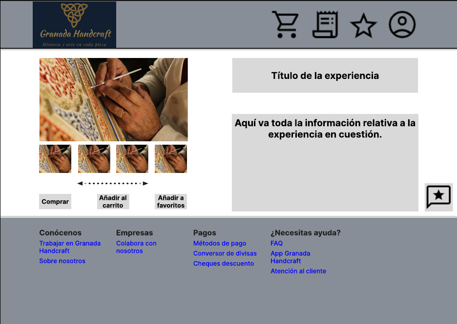

#### Personalizar experiencia (clientes)

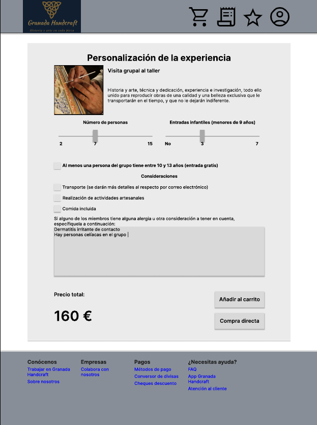

#### Panel de comentarios (clientes)

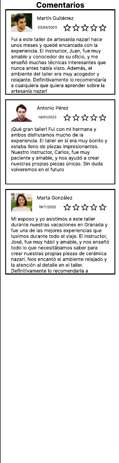

#### Carrito (clientes)

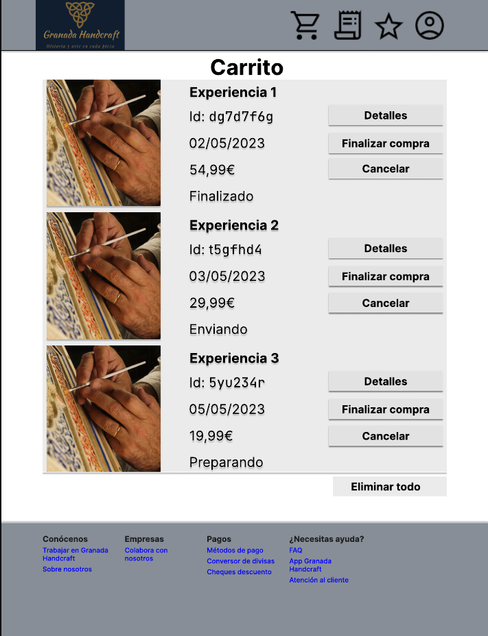

#### Historial (clientes)

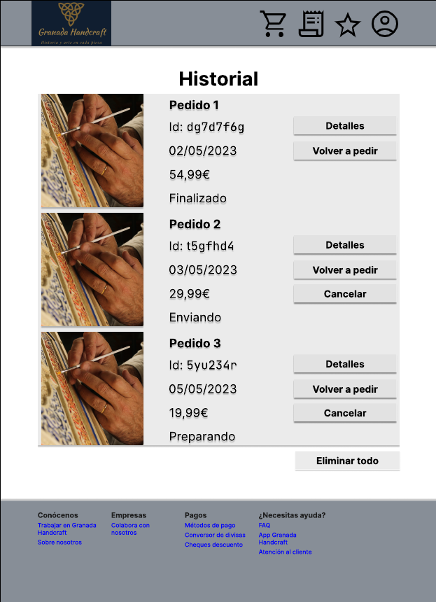

#### Perfil (clientes)

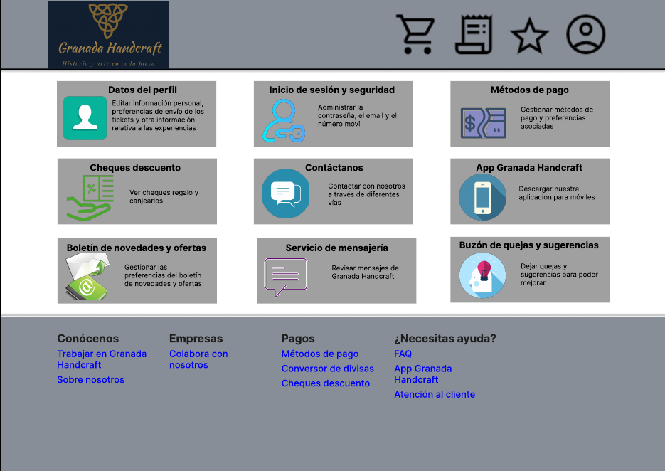

#### Finalización de la compra (clientes)

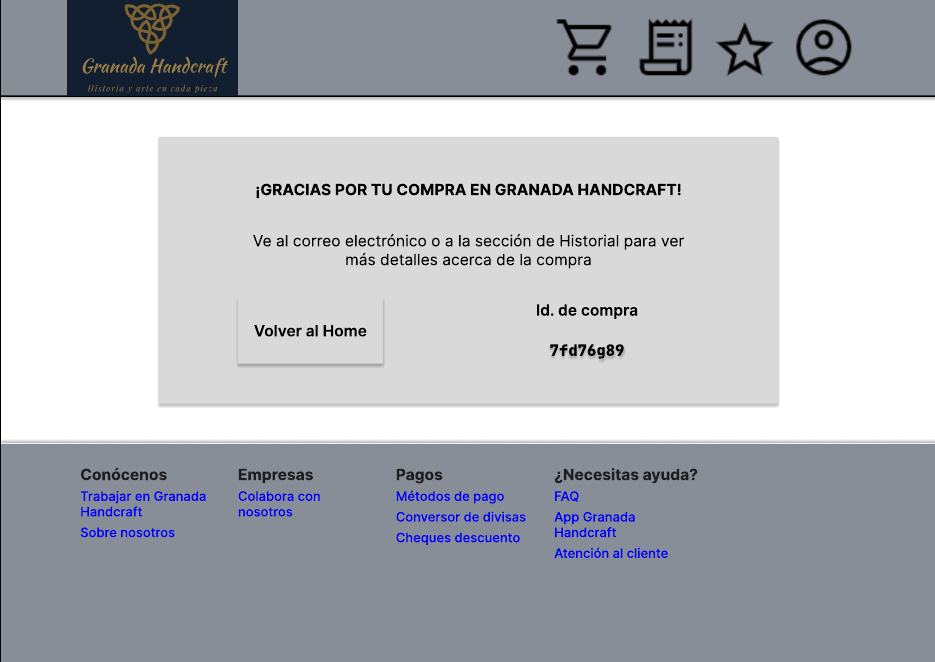

#### Edición de servicios en una experiencia (empresas)

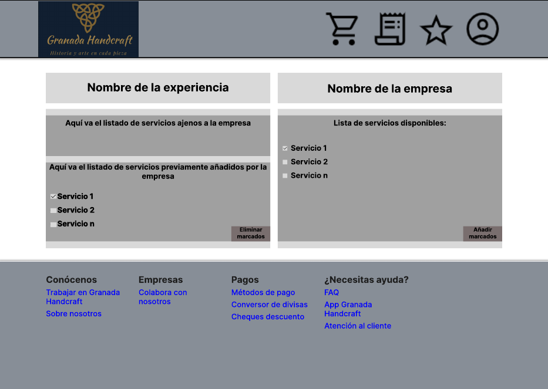

#### Descripción experiencia (empresas)

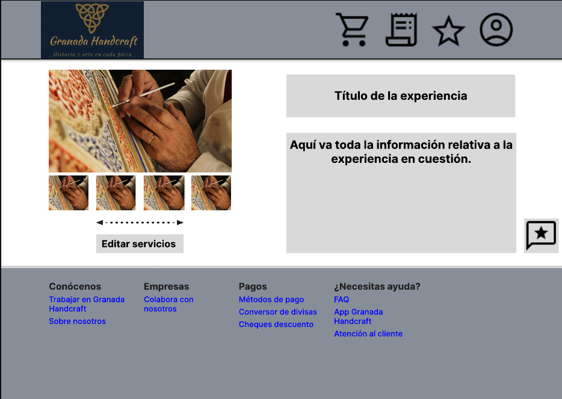

#### Perfil (empresas)

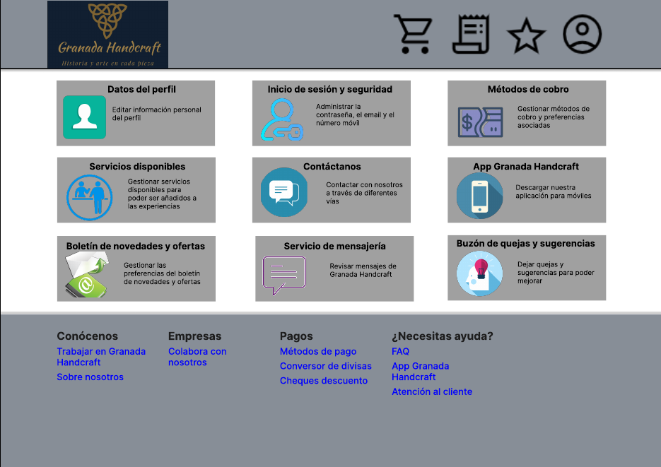

### CONCLUSIONES  

 A lo largo de esta etapa se ha ido desarrollando una paulatina orientación al diseño, velando por identificar aquellas críticas constructivas de la etapa anterior, de manera que fuera posible diseñar una aplicación web que, además de mejorar estos aspectos señalados, aportase cierto grado de valor añadido. Es por esto que se ha realizado un análisis de tareas, fundamental también de cara al siguiente paso del proceso (arquitectura de información). Finalmente, se ha procedido a realizar un prototipo de diseño preliminar que refleje un poco la estructura y funcionamiento de nuestro proyecto.

 Es reseñable comentar que, para lograr cuadrar los diseños, se han tenido que llevar a cabo algunas reconceptualizaciones, por lo que esta etapa no sigue una progresión lineal, sino cíclica. Esto es así porque, conforme se avanza en el proceso, se hace necesario revisar y/o modificar lo realizado hasta el momento.

 Tras todo lo anteriormente comentado, hemos podido comprobar la relevancia y complejidad de la etapa de diseño, pues surgen numerosas preguntas e inquietudes a las que hay que dar respuesta para que las etapas posteriores puedan tener la suficiente consistencia y valor.
