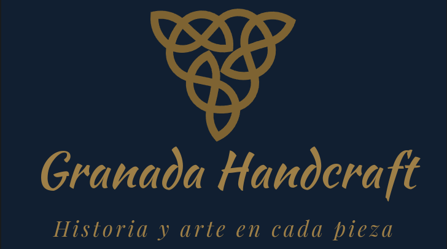

## DIU - Práctica 2
Prácticas Diseño Interfaces de Usuario 2022-23 (Tema: turismo)

Grupo: DIU3.LosMijos  Curso: 2022/23 
Actualizado: 25/04/2023

Proyecto: 
>>> Granada Handcraft: aplicación web de compra de experiencias personalizables de artesanía nazarí en la ciudad de Granada.

Descripción: 
>>> Nuestra aplicación web está orientada a la personalización de una especie de paquetes turísticos enfocados a la artesanía nazarí en Granada. La idea es ofrecer un conjunto de opciones elegibles por el usuario final, dotándolo de flexibilidad, de manera que tenga mayor interés en la realización de este tipo de actividades.

Logotipo:

Miembros
 * :bust_in_silhouette:   Luis Miguel Guirado Bautista     :octocat:     
 * :bust_in_silhouette:   Miguel Ángel Serrano Villena     :octocat:

### Ideación

>>> Tras haber analizado los defectos de las visitas a los talleres de artesanía nazarí de Granada, así como tras haber elaborado una serie de críticas constructivas en torno a esto, hemos ideado una propuesta para impulsar este tipo de experiencias en la ciudad de Granada. Para ello, hemos diseñado una aplicación web enfocada en esto mismo, pero aportando aspectos novedosos e interesantes, de cara a mejorar la experiencia de los/as usuarios/as finales: Granada Handcraft.

#### Malla receptora de información

Hemos elegido esta herramienta por la facilidad de uso junto con la agilidad visual que brinda a la hora de ver rápidamente aspectos relacionados con el surgimiento de la idea de nuestra aplicación web.

### PROPUESTA DE VALOR
* ScopeCanvas

### TASK ANALYSIS

* User Task Matrix 
* User/Task flow

### ARQUITECTURA DE INFORMACIÓN

* Sitemap 
* Labelling 

### Prototipo Lo-FI Wireframe 

### Conclusiones  
(incluye valoración de esta etapa)
