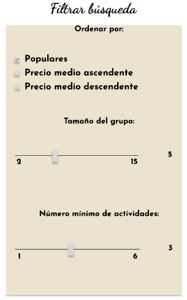
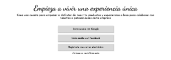
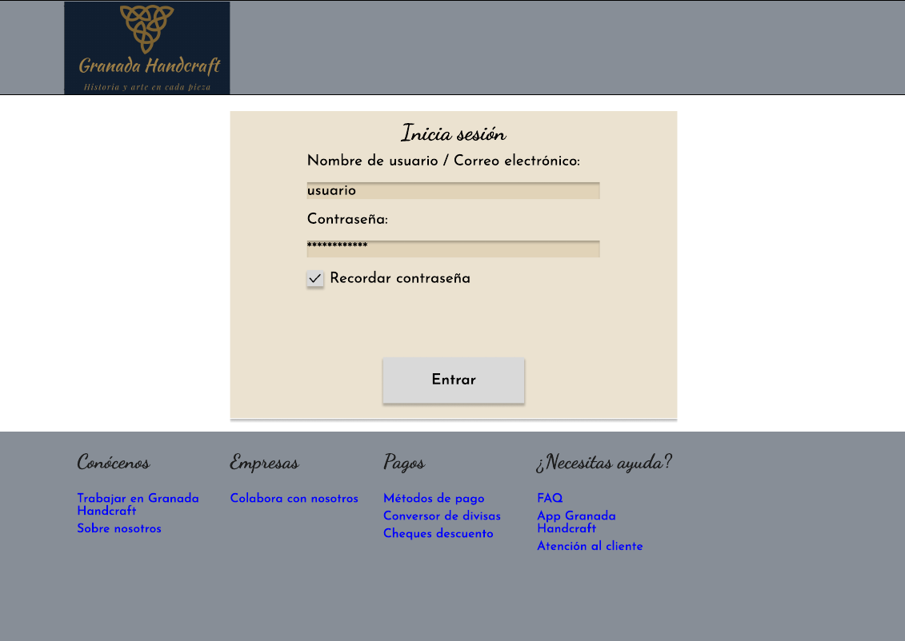
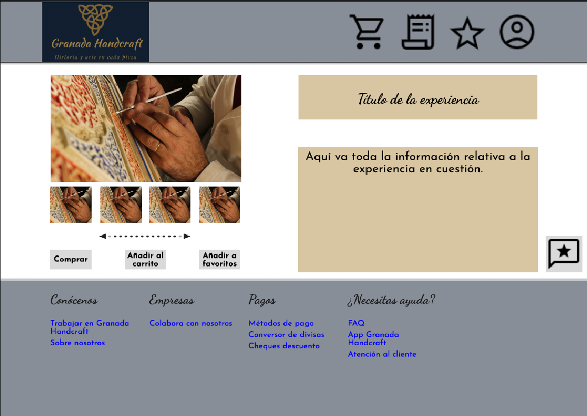
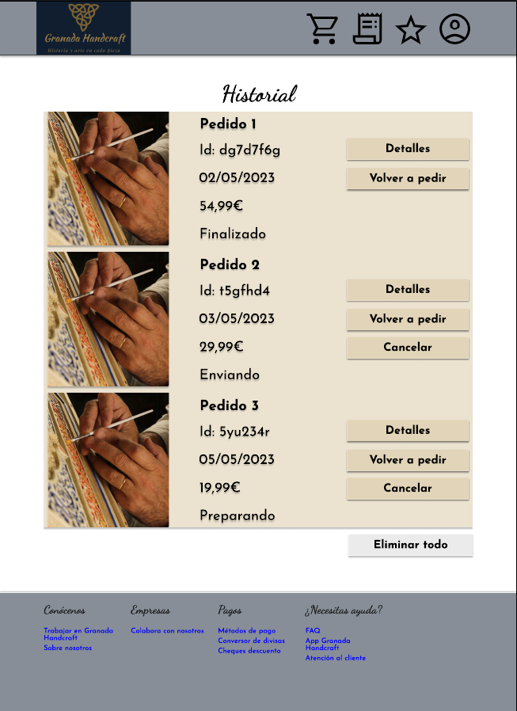
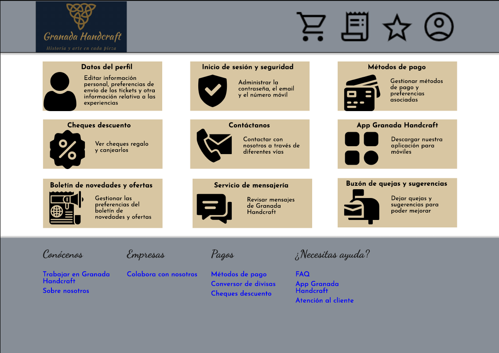
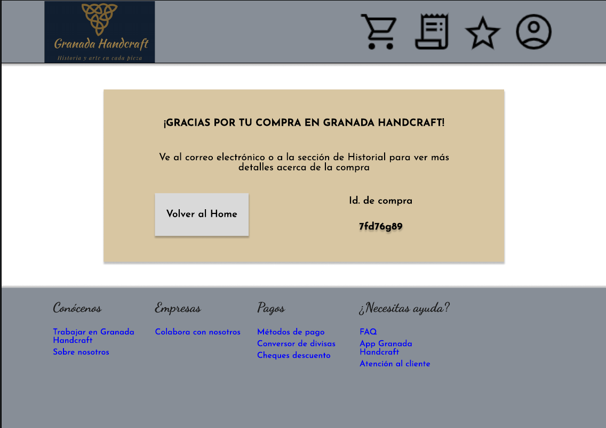
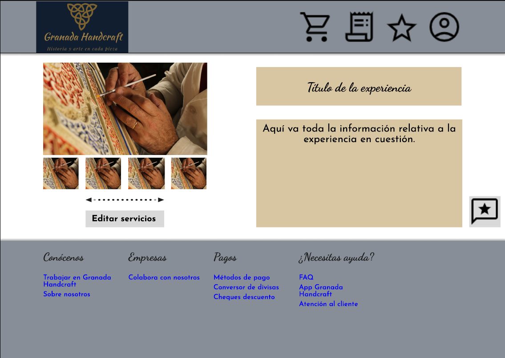

# DIU - Práctica 3
Prácticas Diseño Interfaces de Usuario 2022-23 (Tema: turismo)

Grupo: DIU3.LosMijos  Curso: 2022/23 
Actualizado: 25/04/2023

Proyecto: 

>>> Granada Handcraft: aplicación web de compra de experiencias personalizables de artesanía nazarí en la ciudad de Granada.

Descripción: 

>>> Nuestra aplicación web está orientada a la personalización de una especie de paquetes turísticos enfocados a la artesanía nazarí en Granada. La idea es ofrecer un conjunto de opciones elegibles por el usuario final, dotándolo de flexibilidad, de manera que tenga mayor interés en la realización de este tipo de actividades. Además, cabe reseñar que queremos involucrar a empresas locales tanto para ampliar las opciones de personalización, como fomentar una sinergia de empresas locales.

>>> En esta práctica se va a definir el estilo visual de la página web, por lo que se hará uso de diversas herramientas y metodologías de trabajo para tal fin. Estos recursos empleados se mencionarán a lo largo de este documento.

Logotipo:

Miembros

 * :bust_in_silhouette:   Luis Miguel Guirado Bautista     :octocat:     
 * :bust_in_silhouette:   Miguel Ángel Serrano Villena     :octocat:

GitHub: 

  * https://github.com/DIU3-LosMijos/DIU3.LosMijos

## Moodboard (diseño visual + logotipo)   

>> La primera fase de este proceso consiste en desarrollar un tablero de inspiración que recoja diferentes aspectos de diseño de nuestra página web. No todo lo que aparezca en este tablero debe de aparecer en los bocetos HI-FI que se van a perfilar de la práctica anterior, aunque es importante lograr que haya consistencia entre el resultado final de dicho tablero y el de los mencionados bocetos.

## Landing Page

## Patrones y *Guidelines* usados

### Patrones de interfaz de usuario

- Pestañas de navegación:
  los usuarios pueden acceder a secciones importantes de la aplicación mediante un conjunto de botones que cumplen con la misma funcionalidad que puede tener un conjunto de pestañas.       Presente en todas las páginas salvo en *landing page*.
  
  
  
- *Fat Footer*:
  las páginas web tienen un pie de página común con enlaces de interés. Presente en todas las páginas.
  
  
   
- Enlace al *home*:
  en la cabecera hay un logo que redirige al *home* si el usuario hace clic sobre él. Presente en todas las páginas.
  
  
  
- Miniaturas:
  el usuario tiene a su disposición un conjunto de imágenes que describen visualmente lo que tiene que ofrecer la aplicación. Presente en el *home*, la descripción de experiencia y en la *landing page*.
  
  
  
- Tarjetas:
  conjuntos de información, normalmente suelen ser conjuntos de una foto y texto. Presente en el historial, la página de favoritos, el carrito y en la *landing page*.
  
  
  
- Carrusel:
  parecido al elemento de la paginación pero sin indexar, puede ser automático y cuando llega al final, vuelve al principio. Usado en la landing page, en la descripción de la experiencia y en el *home*.
  
  
  
- Deslizadores:
  utilizados en los filtros de búsqueda y en la personalización de búsqueda para evitar que el usuario ponga números negativos y que solo pueda escoger entre un rango.
  
  
  
- Sección de favoritos: (ver el boceto de "Favoritos (clientes y empresas)").

- Filtros de búsqueda:
  el usuario puede ordenar lo que se le muestra en el *home* según los criterios mostrados.
  
  
  
- Presentación de diapositivas:
  diapositivas que muestran elementos, se suelen manejar con un carrusel. Presente en el *home* y en la descripción de experiencia.
  
  
  
- FAQ:
  se puede acceder en el *fat footer*.
  
  
  
- Página de producto:
  la página de descripción y personalización de experiencia tienen el papel de páginas de producto.
  
- Carrito de la compra: (ver el boceto "Carrito (clientes)").

- Registro perezoso:
  el usuario puede registrarse con una cuenta de Google o Facebook si asi lo desea.
  
  
  
- Registro de cuentas.

### *Guidelines*

- Iconos de la cabecera del *home*
Transmiten con claridad a la página a la que llevan con un icono minimalista

## Mockup: LAYOUT HI-FI

>> Dado que en la práctica anterior realizamos unos prototipos con más detalle del debido, en esta ocasión nos hemos centrado en matizar ciertos detalles en base al moodboard presentado al principio. Es por esto que hemos vuelto a utilizar Figma como herramienta para este apartado, pues nos ha permitido aplicar los estilos requeridos sin nigún problema. Sin más dilación, el resultado del refinamiento de esos bocetos, quitando la landing page presentada en el apartado anterior, es el que sigue:

#### Inicio de sesión (clientes y empresas)

#### Registro (clientes y empresas)

#### Home page (clientes y empresas)

#### Favoritos (clientes y empresas)

#### Descripción experiencia (clientes)

#### Personalizar experiencia (clientes)

#### Panel de comentarios (clientes)

#### Carrito (clientes)

#### Historial (clientes)

#### Perfil (clientes)

#### Finalización de la compra (clientes)

#### Edición de servicios en una experiencia (empresas)

#### Descripción experiencia (empresas)

#### Perfil (empresas)

## Documentación: Publicación del Case Study
 
Planteamos el moodboard y parte del *layout* de forma no intencionada durante la practica 2, de forma que solamente teniamos que refinar el trabajo anterior
para que se ajuste a los objetivos de la práctica

De momento, el proceso de diseño está siendo bastante favorable, existen algunas cosas más que se podrían revisar de los patrones de la interfaz:
- Inicio de la *landing page*: Al principio hay una imagen grande y centrada que no transmite información al usuario y con espacio desaprovechado
- Uso de deslizadores en la entrada de enteros. Puede no ser una opción adecuada en ciertos casos, pero se resalta que son de tipo discretos
