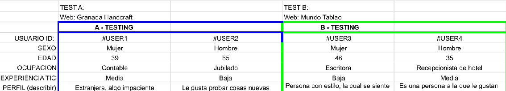
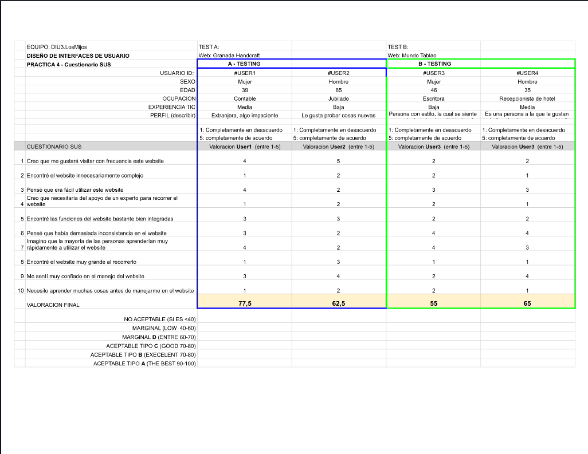
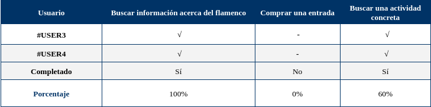

# DIU - Practica 4
Prácticas Diseño Interfaces de Usuario 2022-23 (Tema: turismo)

Grupo: DIU3.LosMijos  Curso: 2022/23
Actualizado: 04/06/2023

Miembros

 * :bust_in_silhouette:   Luis Miguel Guirado Bautista     :octocat:     
 * :bust_in_silhouette:   Miguel Ángel Serrano Villena     :octocat:

GitHub: 

  * https://github.com/DIU3-LosMijos/DIU3.LosMijos

## Usuarios

Para ver una información más amplia, ver el informe de usabilidad [Informe de usabilidad](#Usability-Report-de-Caso-B).

## Cuestionario SUS

Documento PDF: 

## Tareas realizadas

## Usability Report de Caso B

Documento PDF con el informe completo: 

## Conclusiones

El diseño tiene una serie de puntos que habría que corregir, pues rompen un poco con la armonía visual e incluso funcional del sistema. Una vez subsanados estos puntos, el diseño pasaría a tener consistencia, apreciándose una mejora notable con poco esfuerzo más en el proceso de depuración y reconceptualización del diseño del prototipado. Los puntos referidos son los siguientes:

- El logo está como fuera del resto del encabezado de la página web, cuando éste siempre es importante, puesto que es la marca de la empresa (muchas veces ayuda a las personas a reconocerla rápidamente); es importante que esté más marcado su lugar en el encabezado.

- Falta de consistencia entre ventanas. Como ejemplo cabe mencionar que la página del “Buscador” y la de “Conoce el flamenco” presentan entre ellas algunas diferencias reseñables pese a que cuentan con la misma estructura: en la primera, el fondo de los elementos centrales es blanco y, en la segunda, es verde oscuro. Sin entrar en el análisis de qué colores son mejores o peores, debería de existir coherencia entre todas las ventanas. También cabe mencionar que el redondeado de las cajas no sigue un mismo patrón. Además, en este mismo punto, aparece lo que se conoce como miga de pan (ruta de dónde se encuentra el usuario en un momento dado dentro del sitio web), aunque solo aparece en los dos primeros prototipos.

- En la página del “Buscador”, la parte destinada a interactuar con el usuario de cara a aplicar ciertos filtros de búsqueda, no se ha realizado de una manera consistente, puesto que no se distingue claramente la etiqueta del campo del input donde se introducirá realmente el valor para el filtrado. Es decir, como ejemplo, el campo de “Fecha” (la etiqueta) puede confundirse con el propio input.

- Aunque no era el objetivo principal del prototipo, hubiese estado bien aportar algún diseño para el proceso de compra, ya que se puede observar la opción de comprar en cada espectáculo, pero, sin embargo, no hay ninguna forma de poder analizar esta parte del proceso que siempre es importante.

- En la landing page faltaría la posibilidad de saltar al formulario de registro, puesto que es una funcionalidad con la que cuenta el sistema y, para poder hacerlo, habría que pasar de esta ventana.

- En la paleta de colores del moodboard del prototipo aparece el negro como color destacado, pero no se ve resaltado en los prototipos. En cambio, el naranja es el color mayoritario y aparece en dicho moodboard como color menos destacable.
