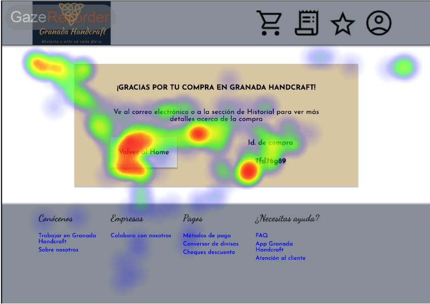

# DIU - Practica 5
Prácticas Diseño Interfaces de Usuario 2022-23 (Tema: turismo)

Grupo: DIU3.LosMijos  Curso: 2022/23 
Actualizado: 25/04/2023

Proyecto: 

Granada Handcraft: aplicación web de compra de experiencias personalizables de artesanía nazarí en la ciudad de Granada.

Descripción: 

Nuestra aplicación web está orientada a la personalización de una especie de paquetes turísticos enfocados a la artesanía nazarí en Granada. La idea es ofrecer un conjunto de opciones elegibles por el usuario final, dotándolo de flexibilidad, de manera que tenga mayor interés en la realización de este tipo de actividades. Además, cabe reseñar que queremos involucrar a empresas locales tanto para ampliar las opciones de personalización, como fomentar una sinergia de empresas locales.

En esta práctica se va a definir el estilo visual de la página web, por lo que se hará uso de diversas herramientas y metodologías de trabajo para tal fin. Estos recursos empleados se mencionarán a lo largo de este documento.

Logotipo:

Miembros

 * :bust_in_silhouette:   Luis Miguel Guirado Bautista     :octocat:     
 * :bust_in_silhouette:   Miguel Ángel Serrano Villena     :octocat:

GitHub: 

  * https://github.com/DIU3-LosMijos/DIU3.LosMijos

## Diseño del experimento

Se ha utilizado la herramienta Gaze Recorder. Para ello, simplemente se han escogido cuatro prototipos de nuestro diseño que suponnen lo más importante de éste y se han adjuntado en el experimento, de cara a comprobar si los dos usuarios a los que se les ha realizado ponen el foco visual en los elementos que deberían para desarrollar, de una forma correcta y ágil, lo que se supone que representan estos diseños. Sin más dilación, se presentan los resultados de ambos usuarios:

### Usuario 1

### Usuario 2

### Usuario experto

## Conclusiones

Conclusiones de apartados anteriores 

Puntos fuertes y de mejora de los criterios de accesibilidad de tu diseño
