# DIU23
Prácticas Diseño Interfaces de Usuario 2022-23 (Tema: turismo)

Grupo: DIU3.LosMijos  Curso: 2022/23 
Updated: 19/05/2023

Proyecto: 

>>> Granada Handcraft: aplicación web de compra de experiencias personalizables de artesanía nazarí en la ciudad de Granada.

Descripción: 

>>> Nuestra aplicación web está orientada a la personalización de una especie de paquetes turísticos enfocados a la artesanía nazarí en Granada. La idea es ofrecer un conjunto de opciones elegibles por el usuario final, dotándolo de flexibilidad, de manera que tenga mayor interés en la realización de este tipo de actividades. Además, cabe reseñar que queremos involucrar a empresas locales tanto para ampliar las opciones de personalización, como fomentar una sinergia de empresas locales.

>>> En esta práctica se va a definir el estilo visual de la página web, por lo que se hará uso de diversas herramientas y metodologías de trabajo para tal fin. Estos recursos empleados se mencionarán a lo largo de este documento.

Logotipo:

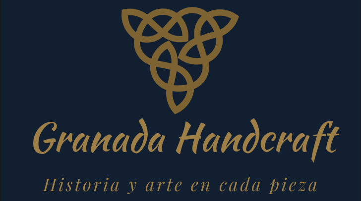

Miembros

 * :bust_in_silhouette:   Luis Miguel Guirado Bautista     :octocat:     
 * :bust_in_silhouette:   Miguel Ángel Serrano Villena     :octocat:

GitHub: 

  * https://github.com/DIU3-LosMijos/DIU3.LosMijos

----- 

# Proceso de Diseño 

## Paso 1. UX Desk Research & Analisis 

1.a Competitive Analysis
-----

>>> Tenemos asignada una página web de artesanía nazarí, concretamente el apartado relativo a visitas a talleres artesanales. Artesanía Nazarí, el nombre oficial, recoge el legado de los grandes maestros artesanos que enriquecieron nuestro patrimonio a lo largo de los siglos, reproduciendo de forma artesanal piezas de nuestro patrimonio mediante el uso de técnicas depuradas para transformar materiales naturales, como el yeso, en piezas únicas trabajadas a mano.

>>> Se ha comparado con La Alboreá (tablao flamenco) y Civitatis, decidiéndonos, en vista a lo recogido en el análisis, por Civitatis, porque el precio es muy bueno, hay mucha publicidad y está presente a nivel mundial, lo que resulta muy interesante para buscar experiencias allá donde se quiera viajar. Además, tiene una página web limpia y clara, con una cantidad de información relativa al evento muy elevada, contando con un sistema de valoraciones y comentairos, lo cual supone un punto especialmente relevante. Es más, cuenta con app móvil, permitiendo usar sus servicios 
cómodamente en cualquier lugar, presentando eventos relacionados.

1.b Persona
-----

Persona 1

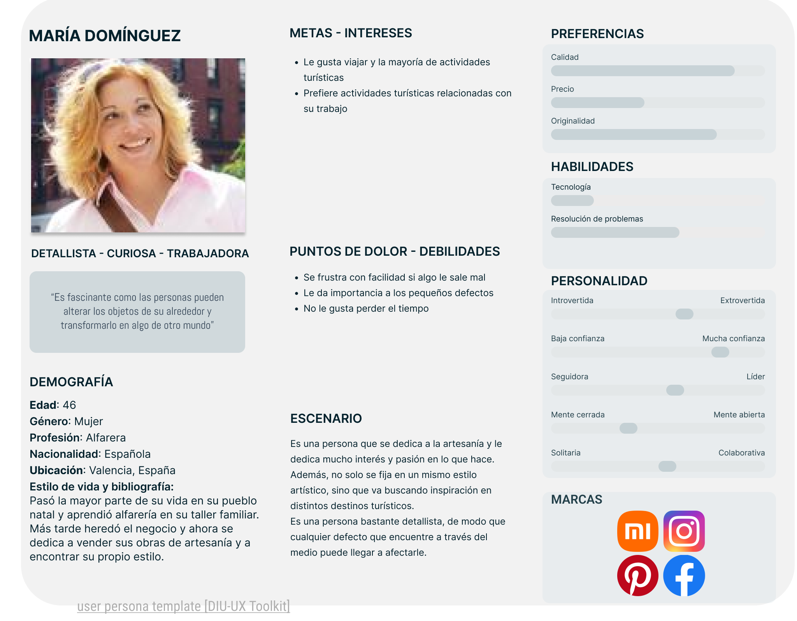

>>> He seleccionado a esta persona porque creo que corresponde con el perfil de alguien que podríamos esperar hoy en día en actividades turísticas de este estilo: una persona de mediana edad, posiblemente con familia y puede que ejerciendo en la artesanía desde joven o en otro campo artístico; ya sea por escapada, por inspirarse en otras obras artesanales o por pasar tiempo en familia.

Persona 2

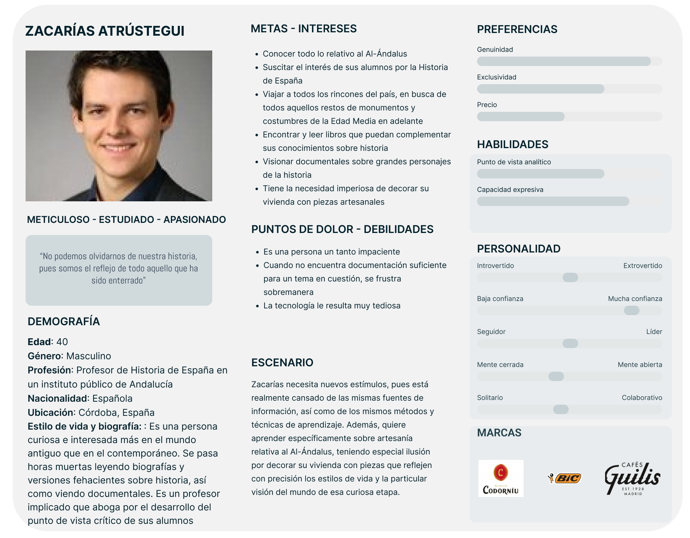

>>> He seleccionado a esta persona porque considero que encaja con uno de los posibles perfiles clásicos de las visitas a los talleres de artesanía nazarí. Esto es así porque tiene una clara inclinación por la historia de España, puesto que es profesor en un instituto, además de contar con un especial interés por el Al-Ándalus. Es por ello, que cualquier aspecto que tenga que ver con esto, como es el caso de la artesanía nazarí y la visita de una ciudad con una tradición morisca como es el caso de Granada, es de sumo interés para él.

1.c User Journey Map
----

User Journey Map 1

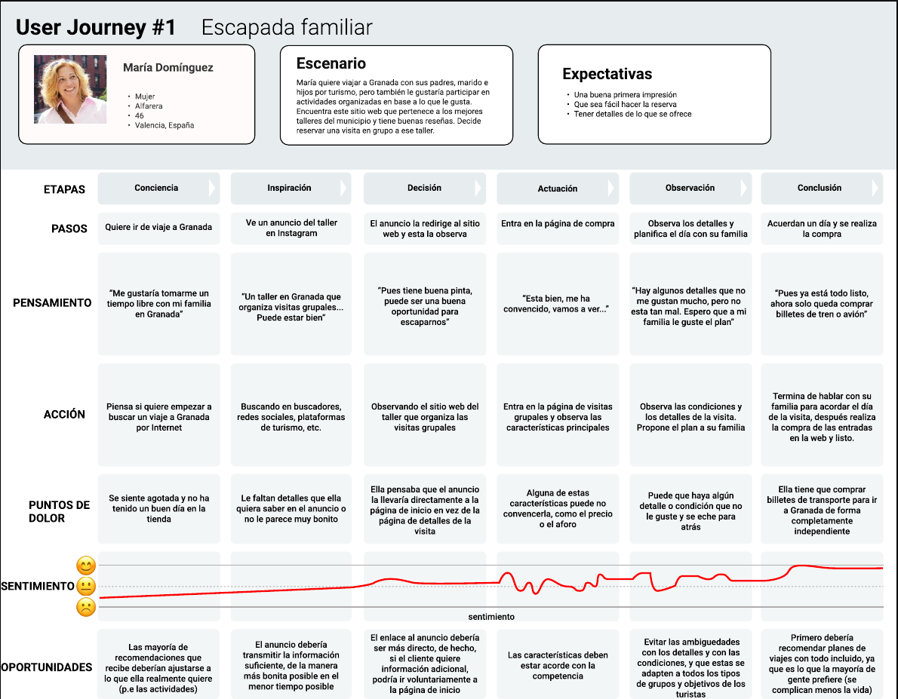

>>> Puede ser cualquier persona que está al menos un poco agotada de trabajar y necesite un tiempo con sus seres queridos. Tiene muy en cuenta los detalles, el precio, las condiciones y la interactividad (como hacer tu propio cuadrante) y estos factores pueden hacerle cambiar de opinión rápidamente

User Journey Map 2

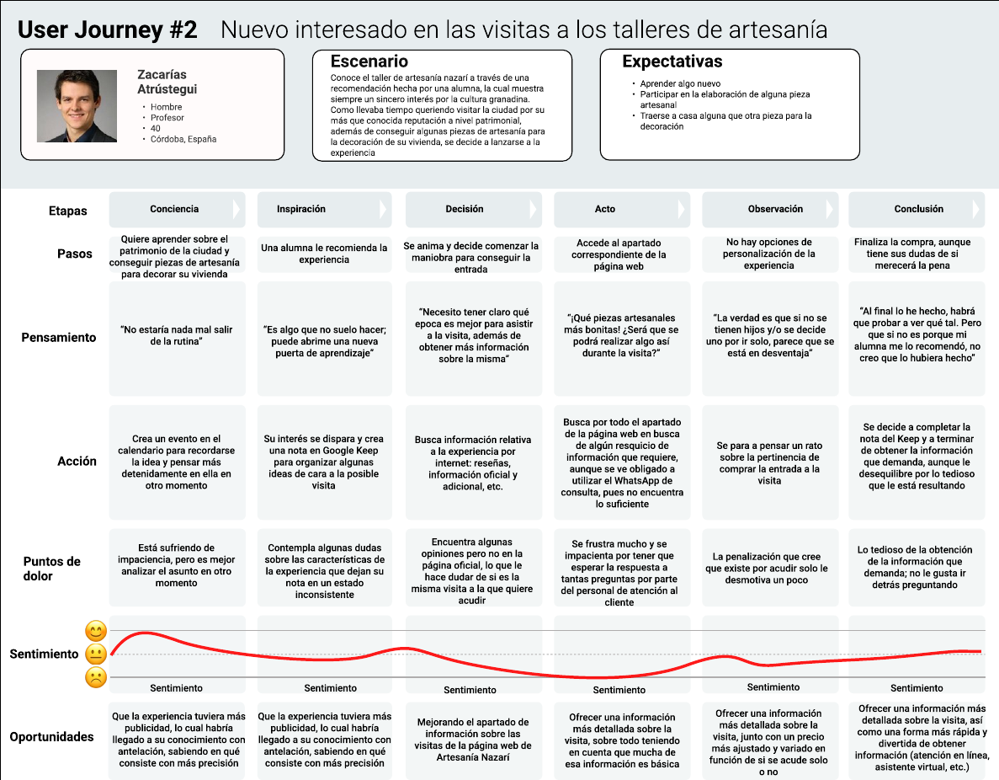

>>> He escogido esta experiencia de usuario porque he considerado que cualquier persona en su situación desearía tener la oportunidad de viajar a Granada realizando una experiencia como esta, pues no deja de ser un reflejo de la cultura nazaría tanto a nivel local como de Andalucía y España. A cualquier persona como él le atraería la idea, por lo que es realmente interesante y pertinente intentar comprender cómo un perfil tan valioso para este tipo de experiencias podría reaccionar durante todo el proceso de compra de las entradas a las visitas.

 1.d Usability Review
----

>>> - Enlace al documento: https://github.com/DIU3-LosMijos/DIU3.LosMijos/blob/master/P1/Usability-review.pdf
>>> - Valoración final: 65 puntos.
>>> - Comentario sobre la valoración: El sitio web Artesanía Nazarí contiene numerosos defectos y problemas tanto visuales como funcionales, lo que convierte la experiencia de usuario en algo frustrante y muy alejado de una tendencia positiva a la hora de ultimar el proceso de compra de las entradas para las visitas a los talleres de artesanía nazarí. Cabe destacar lo delicado del proceso de compra, que contiene algunos fallos graves que pueden terminar por comprometer tanto a la empresa como a los clientes.

## Paso 2. UX Design  

### IDEACIÓN

>>> Tras haber analizado los defectos de las visitas a los talleres de artesanía nazarí de Granada, así como tras haber elaborado una serie de críticas constructivas en torno a esto, hemos ideado una propuesta para impulsar este tipo de experiencias en la ciudad de Granada. Para ello, hemos diseñado una aplicación web enfocada en esto mismo, pero aportando aspectos novedosos e interesantes, de cara a mejorar la experiencia de los/as usuarios/as finales: Granada Handcraft.

#### Malla receptora de información

Hemos elegido esta herramienta por la facilidad de uso junto con la agilidad visual que brinda a la hora de ver rápidamente aspectos relacionados con el surgimiento de la idea de nuestra aplicación web.

### PROPUESTA DE VALOR

>> En la descripción del presente archivo se ha aportado información referente a nuestro proyecto web, pero a continuación vamos a reflejar una serie de aspectos relevantes de cara a conformar una estructura más sólida sobre el sentido de nuestro proyecto.
>> Antes de nada, cabe mencionar que hemos analizado las necesidades de nuestros/as usuarios/as, la misión de nuestro proyecto, los objetivos a corto y largo plazo que pretendemos alcanzar como organización, las acciones que pretendemos que lleven a cabo nuestros/as usuarios/as en nuestra web, así como la forma en la que mediremos el éxito de nuestro proyecto (indicadores de éxito).

### TASK ANALYSIS

>> Con la ayuda de la propuesta de valor anterior, hemos identificado quiénes serían nuestros principales usuarios/as. Encontramos dos tipos de usuarios/as: por un lado, tenemos a los/as usuarios/as que harán uso de la web para comprar experiencias y, por otro, tenemos a empresas locales que colaborarán con nosotros para aparecer como opciones en la personalización de las experiencias.
>> Dicho esto, vamos a proceder a especificar más cada uno de estos/as tipos de usuarios/as:
>> * Los/as usuarios/as principales, que serán los/as que comprarán las experiencias. Estos/as podrán ver las diferentes experiencias que se ofertan, modificar diversas opciones de sus perfiles de usuario, realizar reseñas y valoraciones y, por supuesto, comprar las entradas para dichas experiencias (teniendo a su disposición varios tipos de funcionalidades para la gestión de las compras, como son un historial con experiencias ya compradas en el pasado, un carrito con las compras pendientes de finalizar y un apartado con las experiencias marcadas como favoritas). Dentro de este conjunto, se pueden distinguir los siguientes grupos de usuarios/as:
>>     * Grupos normales: conjunto de personas adultas que quieren acudir juntas a la experiencia.
>>     * Grupos especiales: conjunto de personas adultas junto con menores de edad que quieren acudir juntas a la experiencia.
>>     * Individuos: personas que quieren acudir en solitario a la experiencia.
>> * Las empresas locales colaboradoras, que serán las que podrán añadir sus servicios al sistema. Estas únicamente podrán añadir sus servicios a las distintas experiencias que les interesen y modificar diversas opciones de sus perfiles de usuario.
>> A continuación se presenta una matriz con las tareas que se pueden realizar en nuestra web (filas) y los tipos y subtipos de usuarios de nuestro sistema (columnas). En esta matriz se representa tanto la frecuencia de uso de cada tarea en función del tipo de usuario (A: alta, M: media, B: baja), como las tareas y perfiles más críticos e importantes (marcados con un fondo gris; esto ayudará a indentificar claramente aquellas tareas que deben de ser diseñadas con más detalle):

>> Nota: el motivo que nos ha llevado a elegir esta herramienta es la posibilidad de comprimir una información tan amplia e importante como esta, pudiendo observar fácil y rápido la funcionalidad general del sistema y el comportamiento de los diferentes usuarios/as con esta.

### ARQUITECTURA DE INFORMACIÓN

#### *Sitemap*

Esquema de la estructura de nuestro sitio web

#### Labelling

Descripción breve de cada una de las páginas indicadas en el *Sitemap*

| Nombre      | Descripción |
|-------------|-------------|
| **Landing page** | Primera página que verán los usuarios nuevos y empresas. Tendrá una introducción llamativa (contenido destacado de la empresa). Incluirá información de contacto y ubicación |
| **Inicio de sesión** | Página dirigida a todos los usuarios y empresas que tengan una cuenta en la plataforma para que puedan iniciar una nueva sesión |
| **Registro** | Dirigida a usuarios y/o empresas que deseen crear una nueva cuenta en la plataforma |
| **Home** | Página principal para usuarios y empresas ya registrados, tendrá formato de tienda online, con una galería deslizante con las imágenes de lo que ofrece la plataforma y filtros para buscar según ciertos criterios |
| **Carrito** | Lista de los productos pendientes a comprar por una cuenta. Se podran ver los detalles de los productos, comprar alguno de los productos o eliminarlos de la lista. Una vez se desee tramitar la compra, se vaciará el carrito. |
| **Fin de compra** | Pantalla con instrucciones para hacer un seguimiento de los productos comprados. También se generará un identificador de pedido. |
| **Favoritos** | Productos guardados por el usuario para su interés. Se podrán ver los detalles de los productos, comprarlos directamente, añadirlos al carrito o quitarlos de la misma lista. |
| **Historial** | Lista de pedidos realizados anteriormente. Se podrán ver los detalles del pedido (lista de los productos incluidos) y se podrá volver a añadir al carrito los productos del pedido para su posterior compra. |
| **Perfil** | Un menú con las distintas opciones a personalizar del perfil de una cuenta. Habrá dos versiones: una destinada a los usuarios (cheques de descuento) y otra destinada a las empresas (gestión de servicios) |
| **Experiencia** | Una página más detallada acerca de una experiencia, con una galería de fotos, título y descripción de la misma. Habrá dos versiones: una destinada a los usuarios (añadir al carrito, añadir a favoritos o comprar directamente) y otra destinada a las empresas (editar detalles de la página). También habrá un panel desplegable para publicar comentarios acerca de la experiencia. |
| **Edición** | Exclusiva para empresas. Aquí se podrán editar los detalles de una página concreta. |
| **Personalización** | Exclusiva para usuarios. Aquí el usuario podrá personalizar una experiencia de acuerdo a sus necesidades (número de personas, entradas infantiles, consideraciones, servicios, etc.). Una vez terminado, el usuario podrá añadirlo al carrito o comprarlo directamente |

### Prototipo Lo-FI Wireframe

>> Tras todo lo anterior, en esta sección se presentan los prototipos diseñados para la interfaz de nuestra aplicación web. La misión de estos prototipos es plasmar una visión general del funcionamiento de nuestro sistema.

>> El diseño ha sido llevado a cabo mediante el empleo de Figma en su versión web, la cual es un editor de gráficos vectorial y una herramienta de generación de prototipos que permite el trabajo colaborativo; ha sido una opción estupenda para cubrir perfectamente esta etapa.

>> A continuación se muestran los diferentes prototipos, diferenciando las ventanas que serán vistas en función de las dos áreas diferenciadas en la landing page (clientes y empresas). Los clientes son aquel conjunto que comprará las experiencias y empresas son aquel conjunto de empresas que colaborarán con nosotros para incorporar servicios a las experiencias:

#### Landing page

#### Inicio de sesión (clientes y empresas)

#### Registro (clientes y empresas)

#### Home page (clientes y empresas)

#### Favoritos (clientes y empresas)

#### Descripción experiencia (clientes)

#### Personalizar experiencia (clientes)

#### Panel de comentarios (clientes)

#### Carrito (clientes)

#### Historial (clientes)

#### Perfil (clientes)

#### Finalización de la compra (clientes)

#### Edición de servicios en una experiencia (empresas)

#### Descripción experiencia (empresas)

#### Perfil (empresas)

### CONCLUSIONES  

>> A lo largo de esta etapa se ha ido desarrollando una paulatina orientación al diseño, velando por identificar aquellas críticas constructivas de la etapa anterior, de manera que fuera posible diseñar una aplicación web que, además de mejorar estos aspectos señalados, aportase cierto grado de valor añadido. Es por esto que se ha realizado un análisis de tareas, fundamental también de cara al siguiente paso del proceso (arquitectura de información). Finalmente, se ha procedido a realizar un prototipo de diseño preliminar que refleje un poco la estructura y funcionamiento de nuestro proyecto.

>> Es reseñable comentar que, para lograr cuadrar los diseños, se han tenido que llevar a cabo algunas reconceptualizaciones, por lo que esta etapa no sigue una progresión lineal, sino cíclica. Esto es así porque, conforme se avanza en el proceso, se hace necesario revisar y/o modificar lo realizado hasta el momento.

>> Tras todo lo anteriormente comentado, hemos podido comprobar la relevancia y complejidad de la etapa de diseño, pues surgen numerosas preguntas e inquietudes a las que hay que dar respuesta para que las etapas posteriores puedan tener la suficiente consistencia y valor.

## Paso 3. Mi UX-Case Study (diseño)

## Moodboard (diseño visual + logotipo)   

>> La primera fase de este proceso consiste en desarrollar un tablero de inspiración que recoja diferentes aspectos de diseño de nuestra página web. No todo lo que aparezca en este tablero debe de aparecer en los bocetos HI-FI que se van a perfilar de la práctica anterior, aunque es importante lograr que haya consistencia entre el resultado final de dicho tablero y el de los mencionados bocetos.

## Landing Page

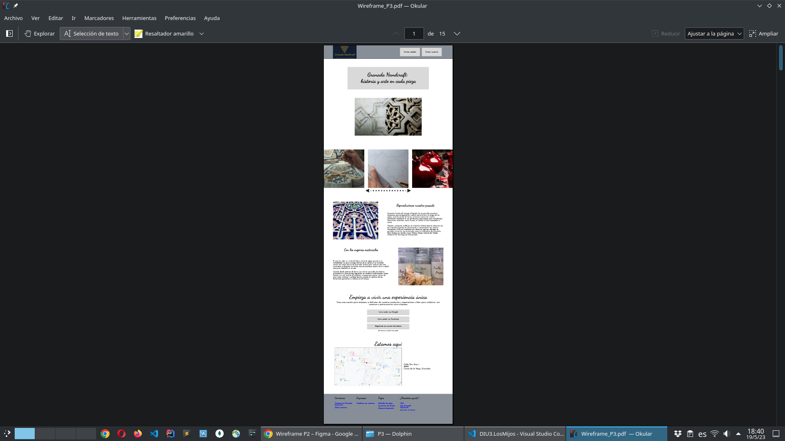

## Patrones y *Guidelines* usados

### Patrones de interfaz de usuario

- Pestañas de navegación:
  los usuarios pueden acceder a secciones importantes de la aplicación mediante un conjunto de botones que cumplen con la misma funcionalidad que puede tener un conjunto de pestañas.       Presente en todas las páginas salvo en *landing page*.
  
  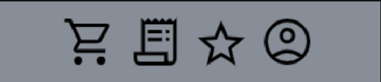
  
- *Fat Footer*:
  las páginas web tienen un pie de página común con enlaces de interés. Presente en todas las páginas.
  
  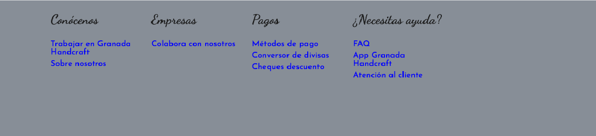
   
- Enlace al *home*:
  en la cabecera hay un logo que redirige al *home* si el usuario hace clic sobre él. Presente en todas las páginas.
  
  
  
- Miniaturas:
  el usuario tiene a su disposición un conjunto de imágenes que describen visualmente lo que tiene que ofrecer la aplicación. Presente en el *home*, la descripción de experiencia y en la *landing page*.
  
  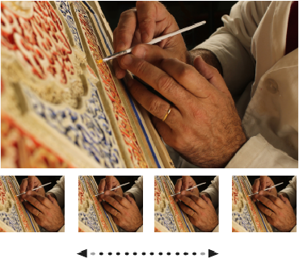
  
- Tarjetas:
  conjuntos de información, normalmente suelen ser conjuntos de una foto y texto. Presente en el historial, la página de favoritos, el carrito y en la *landing page*.
  
  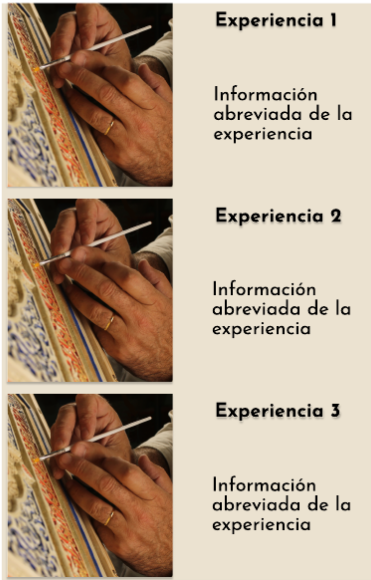
  
- Carrusel:
  parecido al elemento de la paginación pero sin indexar, puede ser automático y cuando llega al final, vuelve al principio. Usado en la landing page, en la descripción de la experiencia y en el *home*.
  
  
  
- Deslizadores:
  utilizados en los filtros de búsqueda y en la personalización de búsqueda para evitar que el usuario ponga números negativos y que solo pueda escoger entre un rango.
  
  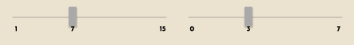
  
- Sección de favoritos: (ver el boceto de "Favoritos (clientes y empresas)").

- Filtros de búsqueda:
  el usuario puede ordenar lo que se le muestra en el *home* según los criterios mostrados.
  
  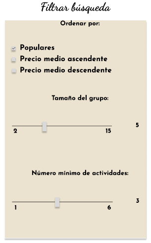
  
- Presentación de diapositivas:
  diapositivas que muestran elementos, se suelen manejar con un carrusel. Presente en el *home* y en la descripción de experiencia.
  
  
  
- FAQ:
  se puede acceder en el *fat footer*.
  
  
  
- Página de producto:
  la página de descripción y personalización de experiencia tienen el papel de páginas de producto.
  
- Carrito de la compra: (ver el boceto "Carrito (clientes)").

- Registro perezoso:
  el usuario puede registrarse con una cuenta de Google o Facebook si asi lo desea.
  
  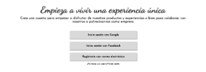
  
- Registro de cuentas.

### *Guidelines*

- Iconos de la cabecera del *home*
Transmiten con claridad a la página a la que llevan con un icono minimalista

## Mockup: LAYOUT HI-FI

>> Dado que en la práctica anterior realizamos unos prototipos con más detalle del debido, en esta ocasión nos hemos centrado en matizar ciertos detalles en base al moodboard presentado al principio. Es por esto que hemos vuelto a utilizar Figma como herramienta para este apartado, pues nos ha permitido aplicar los estilos requeridos sin nigún problema. Sin más dilación, el resultado del refinamiento de esos bocetos, quitando la landing page presentada en el apartado anterior, es el que sigue:

#### Inicio de sesión (clientes y empresas)

#### Registro (clientes y empresas)

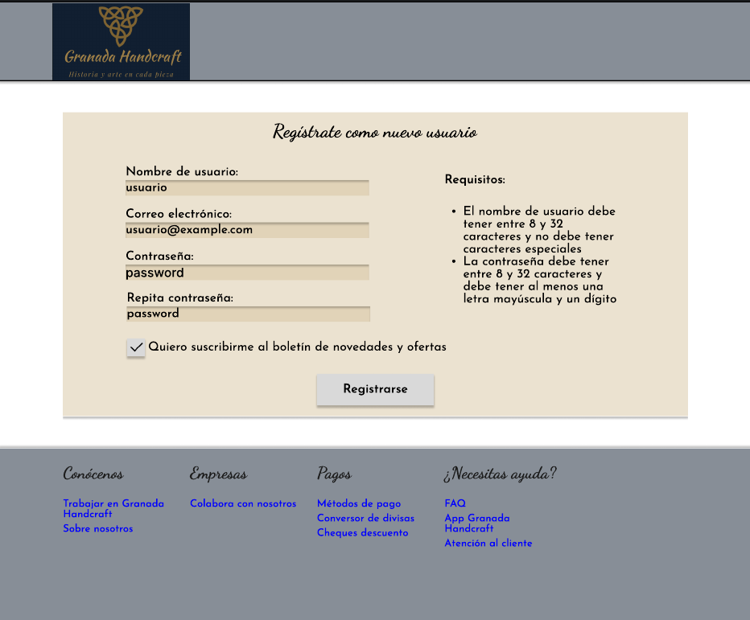

#### Home page (clientes y empresas)

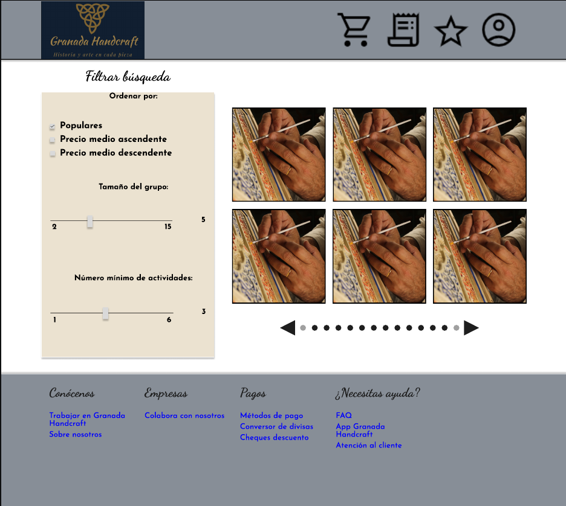

#### Favoritos (clientes y empresas)

#### Descripción experiencia (clientes)

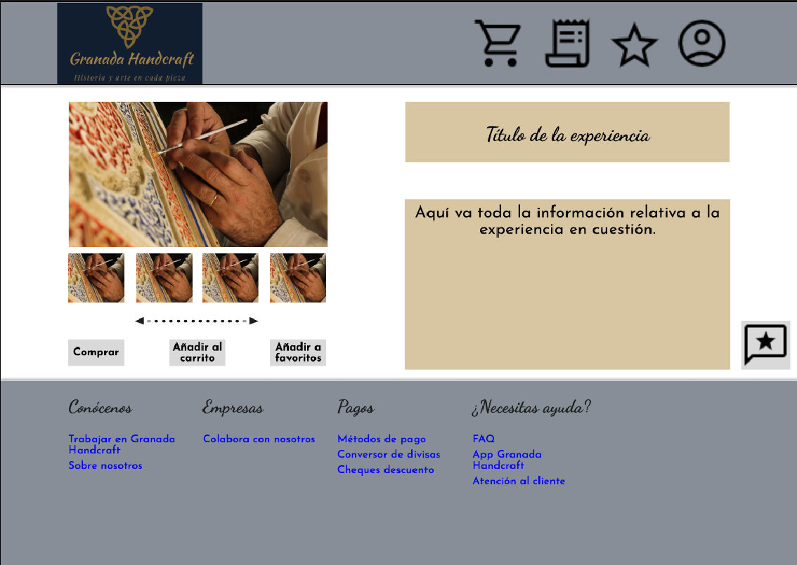

#### Personalizar experiencia (clientes)

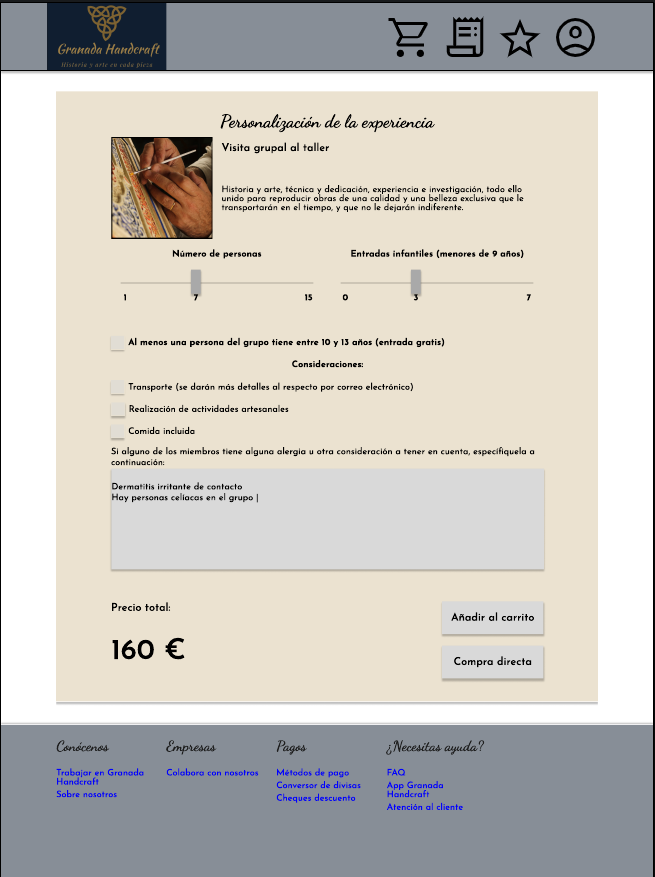

#### Panel de comentarios (clientes)

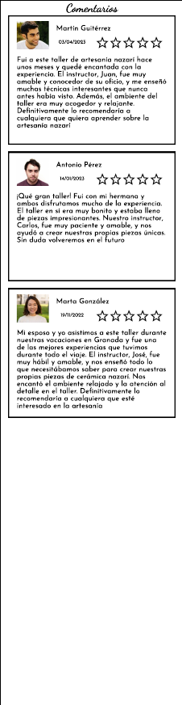

#### Carrito (clientes)

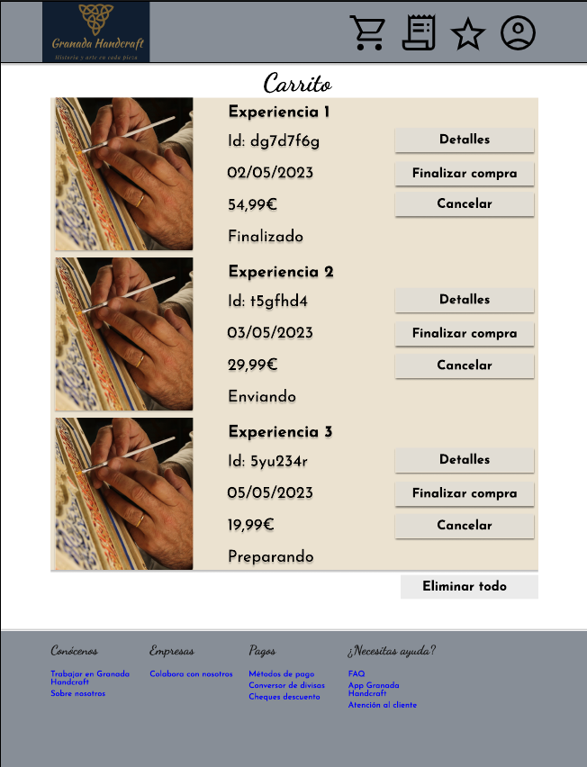

#### Historial (clientes)

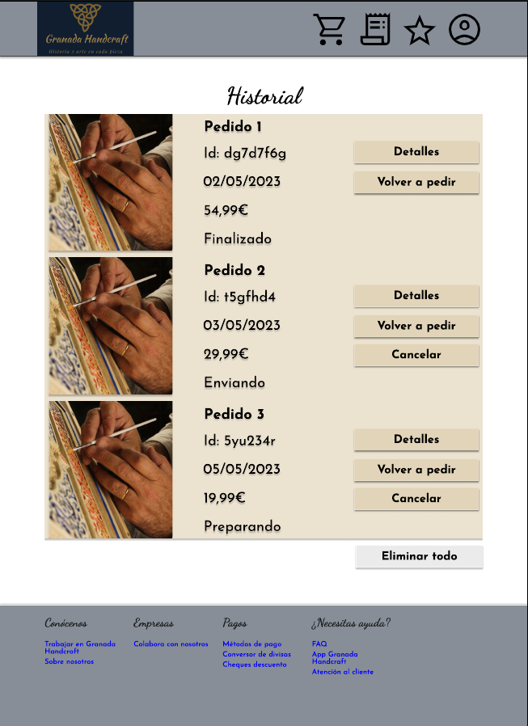

#### Perfil (clientes)

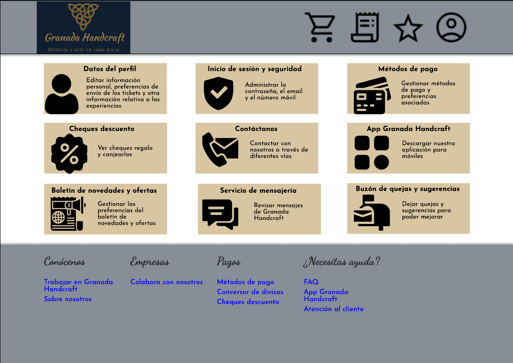

#### Finalización de la compra (clientes)

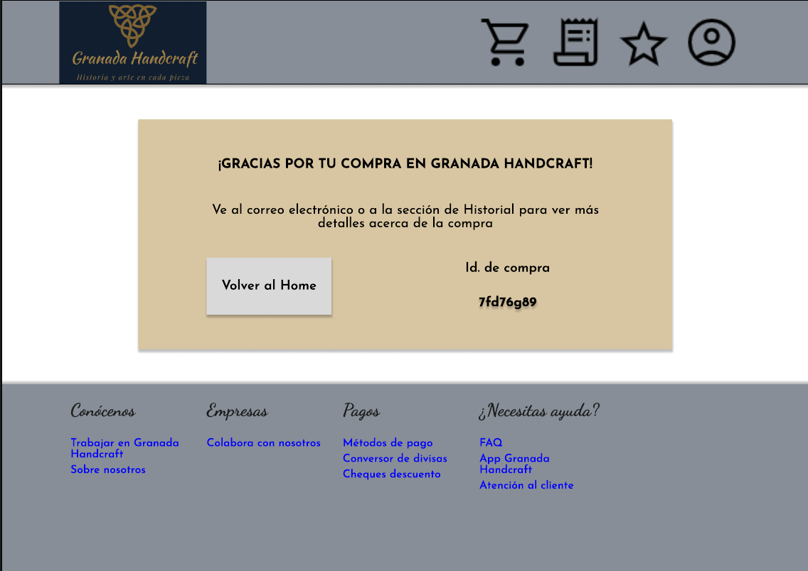

#### Edición de servicios en una experiencia (empresas)

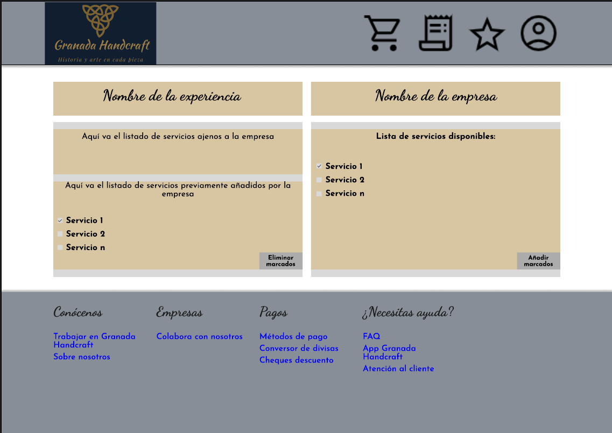

#### Descripción experiencia (empresas)

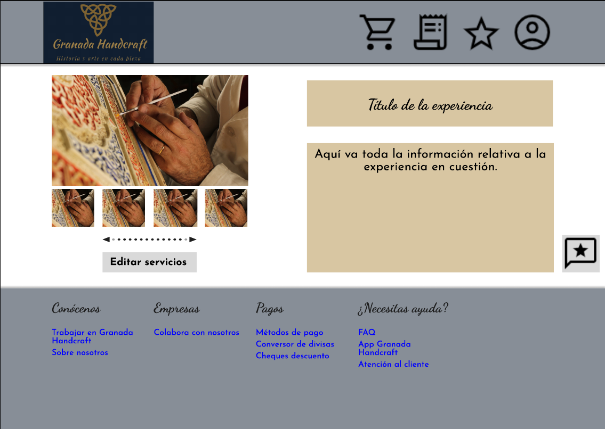

#### Perfil (empresas)

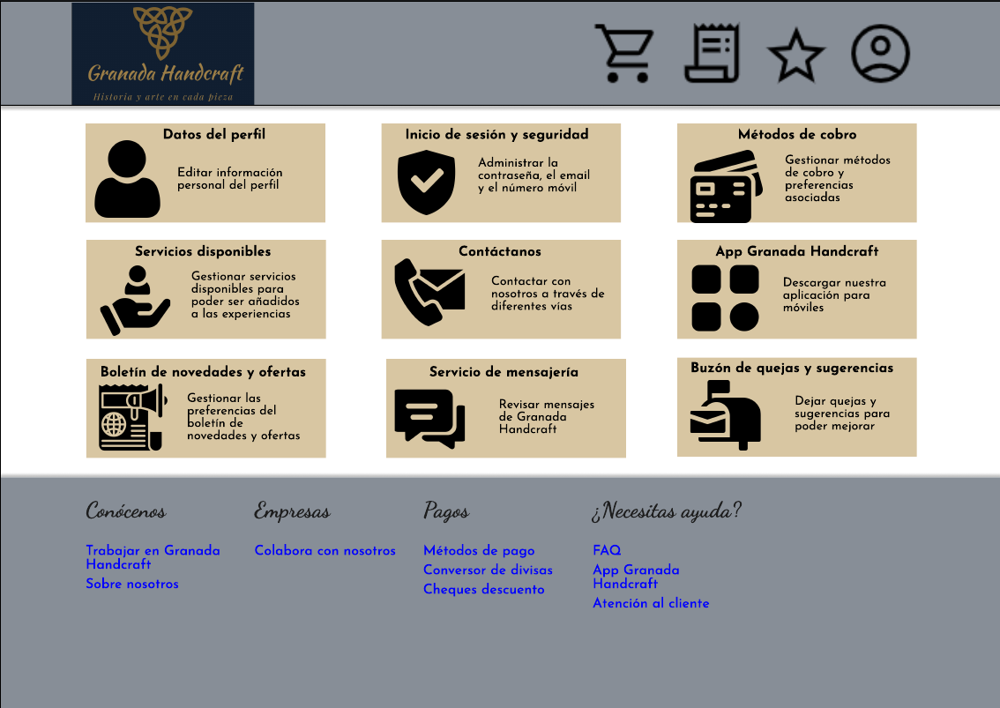

## Documentación: Publicación del Case Study
 
Planteamos el *moodboard* y parte del *layout* de forma no intencionada durante la práctica 2, de forma que solamente teníamos que refinar el trabajo anterior
para que se ajustase a los objetivos de esta práctica.

De momento, el proceso de diseño está siendo bastante favorable; existen algunas cosas más que se podrían revisar de los patrones de la interfaz:
- Inicio de la *landing page*: al principio hay una imagen grande y centrada que no transmite información al usuario y con espacio desaprovechado.
- Uso de deslizadores en la entrada de enteros. Puede no ser una opción adecuada en ciertos casos, pero se resalta que son de tipo discreto.

## Paso 4. Evaluación 

 4.a Caso asignado
----

>>> Breve descripción del caso asignado con enlace a  su repositorio Github

 4.b User Testing
----

>>> Seleccione 4 personas ficticias. Exprese las ideas de posibles situaciones conflictivas de esa persona en las propuestas evaluadas. Asigne dos a Caso A y 2 al caso B
 

| Usuarios | Sexo/Edad     | Ocupación   |  Exp.TIC    | Personalidad | Plataforma | TestA/B
| ------------- | -------- | ----------- | ----------- | -----------  | ---------- | ----
| User1's name  | H / 18   | Estudiante  | Media       | Introvertido | Web.       | A 
| User2's name  | H / 18   | Estudiante  | Media       | Timido       | Web        | A 
| User3's name  | M / 35   | Abogado     | Baja        | Emocional    | móvil      | B 
| User4's name  | H / 18   | Estudiante  | Media       | Racional     | Web        | B 

. 4.c Cuestionario SUS
----

>>> Usaremos el **Cuestionario SUS** para valorar la satisfacción de cada usuario con el diseño (A/B) realizado. Para ello usamos la [hoja de cálculo](https://github.com/mgea/DIU19/blob/master/Cuestionario%20SUS%20DIU.xlsx) para calcular resultados sigiendo las pautas para usar la escala SUS e interpretar los resultados
http://usabilitygeek.com/how-to-use-the-system-usability-scale-sus-to-evaluate-the-usability-of-your-website/)
Para más información, consultar aquí sobre la [metodología SUS](https://cui.unige.ch/isi/icle-wiki/_media/ipm:test-suschapt.pdf)

>>> Adjuntar captura de imagen con los resultados + Valoración personal 

 4.d Usability Report
----

>> Añadir report de usabilidad para práctica B (la de los compañeros)

>>> Valoración personal 

>>> ## Paso 5. Evaluación de Accesibilidad  (no necesaria)

>>>   5.a Accesibility evaluation Report 
>>>> ----

>>> Indica qué pretendes evaluar (de accesibilidad) sobre qué APP y qué resultados has obtenido 

>>> 5.a) Evaluación de la Accesibilidad (con simuladores o verificación de WACG) 
>>> 5.b) Uso de simuladores de accesibilidad 

>>> (uso de tabla de datos, indicar herramientas usadas) 

>>> 5.c Breve resumen del estudio de accesibilidad (de práctica 1) y puntos fuertes y de mejora de los criterios de accesibilidad de tu diseño propuesto en Práctica 4.

## Conclusión final / Valoración de las prácticas

>>> (90-150 palabras) Opinión del proceso de desarrollo de diseño siguiendo metodología UX y valoración (positiva /negativa) de los resultados obtenidos  

